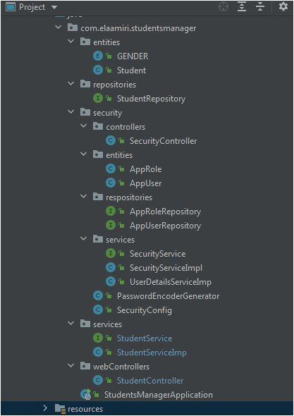

# Students-manager-Spring-activity [video_Demo](https://youtu.be/oj51qMF1_So)

### Enoncé

> Créer une application Web basée sur Spring MVC, Spring Data JPA et Spring Security qui permet de gérer des étudiants.
> Chaque étudiant est défini par:

- Son id
- Son nom
- Son prénom
- Son email
- Sa date naissance
- Son genre : MASCULIN ou FEMININ
- Un attribut qui indique si il est en règle ou non
  L'application doit offrir les fonctionnalités suivantes :
- Chercher des étudiants par nom
- Faire la pagination
- Supprimer des étudiants en utilisant la méthode (DELETE au lieu de GET)
- Saisir et Ajouter des étudiants avec validation des formulaires
- Editer et mettre à jour des étudiants
- Créer une page template
- Sécuriser l'accès à l'application avec un système d'authentification basé sur Spring security en utilisant la stratégie UseDetails Service
- Ajouter d'autres fonctionnalités supplémentaires

### Enoncé

### entité Student

```java
@Data
@Entity
public class Student {

    // TODO: validations
    @Id
    @GeneratedValue(strategy = GenerationType.IDENTITY)
    private long id;
    private String firstName;
    private String lastName;
    private String email;
  @Temporal(TemporalType.DATE)
    private Date birth;
    private GENDER gender;
    private boolean inRule; // an règle

}
```

---

#### las structure du projet



#### Les propiétés de l'application

```conf
# data base cofig
spring.datasource.url=jdbc:mysql://localhost:3306/student-management-crud1?createDatabaseIfNotExist=true
spring.datasource.username=root
spring.datasource.password=

# dialect
spring.jpa.properties.hibernate.dialect = org.hibernate.dialect.MySQL5InnoDBDialect

# ddl
spring.jpa.hibernate.ddl-auto=update

# disable cash
spring.thymeleaf.cache=false

spring.web.resources.static-locations=classpath:templates/, classpath:static/

```

#### Les dipendances

```xml
    <dependencies>
        <dependency>
            <groupId>org.springframework.boot</groupId>
            <artifactId>spring-boot-starter-data-jpa</artifactId>
        </dependency>
        <dependency>
            <groupId>org.springframework.boot</groupId>
            <artifactId>spring-boot-starter-thymeleaf</artifactId>
        </dependency>
        <dependency>
            <groupId>org.springframework.boot</groupId>
            <artifactId>spring-boot-starter-web</artifactId>
        </dependency>

        <dependency>
            <groupId>org.springframework.boot</groupId>
            <artifactId>spring-boot-devtools</artifactId>
            <scope>runtime</scope>
            <optional>true</optional>
        </dependency>
        <dependency>
            <groupId>mysql</groupId>
            <artifactId>mysql-connector-java</artifactId>
            <scope>runtime</scope>
        </dependency>
        <dependency>
            <groupId>org.projectlombok</groupId>
            <artifactId>lombok</artifactId>
            <optional>true</optional>
        </dependency>
        <dependency>
            <groupId>org.springframework.boot</groupId>
            <artifactId>spring-boot-starter-test</artifactId>
            <scope>test</scope>
        </dependency>

        <dependency>
            <groupId>nz.net.ultraq.thymeleaf</groupId>
            <artifactId>thymeleaf-layout-dialect</artifactId>
            <version>3.1.0</version>
        </dependency>

        <dependency>
            <groupId>org.springframework.boot</groupId>
            <artifactId>spring-boot-starter-validation</artifactId>
        </dependency>
        <dependency>
            <groupId>org.springframework.boot</groupId>
            <artifactId>spring-boot-starter-security</artifactId>
        </dependency>

        <dependency>
            <groupId>org.thymeleaf.extras</groupId>
            <artifactId>thymeleaf-extras-springsecurity5</artifactId>
        </dependency>
    </dependencies>

```

#### Entities

Student

```java
@Data
@Entity
public class Student {

    // TODO: validations
    @Id
    @GeneratedValue(strategy = GenerationType.IDENTITY)
    @NotNull
    private long id;
    @NotNull
    @NotBlank
    @Size(max = 50)
    private String firstName;
    @NotNull
    @NotBlank
    @Size(max = 50)
    private String lastName;
    @NotNull
    @NotBlank
    @Email
    private String email;
    @Temporal(TemporalType.DATE)
    @DateTimeFormat(pattern = "yyyy-MM-dd")
    @Past
    private Date birth;
    private GENDER gender;
    private boolean inRule; // an règle

}

```

#### Repository

La gestion du coté base de données.

```java
@Repository
public interface StudentRepository extends JpaRepository<Student, Long> {
    Page<Student> findStudentsByLastNameContainsOrFirstNameContains(String lastName, String firstName, Pageable pageable);
    //Page<Student> findStudentsByLastNameOrFirstName(String keyWord, Pageable pageable);
    long countByGender(GENDER gender);
    long countByInRule(boolean isInRule);

}

```

#### Le code la couche Service Metier

```java
@Service
@Data
@AllArgsConstructor
public class StudentServiceImp implements StudentService{
    private StudentRepository studentRepository; // injected by constructor

    @Override
    public Student saveNewStudent(Student student) {
        if(student == null) throw  new RuntimeException("Invalid Student object (null)!");
        return studentRepository.save(student);
    }


    @Override
    public Page<Student> getStudentsList( String keyword, int pageNumber, int pageSize) {
        if(keyword == null || keyword.equals(""))
            return studentRepository.findAll(PageRequest.of(pageNumber, pageSize));
        return studentRepository.findStudentsByLastNameContainsOrFirstNameContains(keyword, keyword, PageRequest.of(pageNumber, pageSize));
    }

    @Override
    public Optional<Student> getStudentById(long id) {

        return Optional.of(studentRepository.getById(id));
    }

    @Override
    public void deleteStudent(long id) {
        Optional<Student> student = getStudentById(id);
        if(student.isPresent())
            studentRepository.delete(student.get());
        else
            throw new RuntimeException("Can not perform action, student does not exist!");
    }

    @Override
    public Student updateStudent(long id, Student student) {
        Optional<Student> student1 = getStudentById(id);
        if(student1.isEmpty())
            throw new RuntimeException("Can not perform action, student does not exist!");
        return saveNewStudent(student);
    }
    @Override
    public long getCountByGender(GENDER gender){
        return studentRepository.countByGender(gender);
    }
    @Override
    public long getTotalNumberOfStudents(){
        return studentRepository.count();
    }
    @Override
    public long getCountByIsInRule(boolean isInRule){
        return studentRepository.countByInRule(isInRule);
    }
}

```

#### Securité

pour la gestion de la sécurité dans l'application, j'ai utliser une authentification basée sur UserDetailsService.
Les entitées Role et User est la relation entre eux (ManytoMany).

```java
@Entity
@Data
@AllArgsConstructor
@NoArgsConstructor
public class AppUser {
    @Id
    private String userId;
    @Column(unique = false)
    @NotNull
    @NotBlank
    private String username;
    @NotNull
    @NotBlank
    private String password;
    private boolean isActive;
    @ManyToMany(fetch = FetchType.EAGER)
    // un utilisateur peut avoir plusieurs roles
    // EAGER car je souhaite avoir la listes
    // des role de l'utilisateur automatiqument lorsque
    // je charge l'user depuis la base de donée
    // avec LAZY, la liste ne va pas etre charger que
    // quand j'appele user.getAppRoleList ..
    private List<AppRole> appRoleList = new ArrayList<>();
}

```

```java
@Entity
@Data
public class AppRole {
    @Id
    @GeneratedValue(strategy = GenerationType.IDENTITY)
    private long roleId;
    @Column(unique = true)
    @NotNull
    // Je doix pas avoir deux role
    // avec le meme nom
    private String roleName;
    private String roleDescription;

}

```

la configuration de la sécurité (Les autaurisations, et la stratégie de l'autentification).

```java

@Configuration
@EnableWebSecurity
public class SecurityConfig extends WebSecurityConfigurerAdapter {


    @Autowired
    private DataSource dataSource;
    @Autowired
    private UserDetailsServiceImp userDetailsService;

    @Override // spécifier les droits d'accès
    protected void configure(HttpSecurity http) throws Exception {
        http.csrf().disable(); // ?? for delete operation
        /*  Cross Site Request Forgery (CSRF)
            What is the reason to disable csrf in a Spring Boot application?
            You are using another token mechanism.
            You want to simplify interactions between a client and the server.
            More info: https://www.baeldung.com/spring-security-csrf
            More details: https://docs.spring.io/spring-security/site/docs/5.0.x/reference/html/csrf.html
         */
        // droits d'acces
        http.authorizeRequests()
                .antMatchers("/resources/**" ,"/home", "/").permitAll()
                .antMatchers("/resources/**", "/static/**", "/css/**", "/js/**", "/images/**", "/img/**").permitAll()
                .antMatchers("/admin/**").hasAuthority("ADMIN")
                .antMatchers("/user/**").hasAuthority("USER")
                .anyRequest().authenticated(); // PROBLEM SOLVED :
        http.formLogin(); //  default login form
        http.exceptionHandling().accessDeniedPage("/error403");


    }

    @Override // Spécifier la stratégie avec laquelle Spring Sec va
    // chercher les utilisateurs authorisés
    protected void configure(AuthenticationManagerBuilder auth) throws Exception {
        auth.userDetailsService(userDetailsService);
    }

    @Override
    public void configure(WebSecurity web) throws Exception {
        //web.ignoring().antMatchers("/resources/**", "/static/**", "/css/**", "/js/**", "/images/**", "/img/**");
    }


}

```

`Pour éviter le problème des dependances cycliques ou bien circulaires` j'ai ajouter la méthode qui gère le PasswordEncoder dans une classe séparée au lieu d'un @Bean à l'interieur de la classe de la configuration.

```java

@Configuration
public class PasswordEncoderGenerator extends BCryptPasswordEncoder{
        // executé au démarrage, et place
        // l'objet retourné dans le context
        // comme Spring Bean (il peut etre injecté n'import où)
    private PasswordEncoder getPasswordEncoder(){
        // retourner le type d'encodage
        // get spring version
        //System.out.println(SpringVersion.getVersion()); // 5.3.16
        return  new BCryptPasswordEncoder();
    }
}

```

La couche service de la sécurité (l'interface et son implémentation).

```java
@Service
public interface StudentService {
    Student saveNewStudent(Student student);
    Page<Student> getStudentsList(String keyword, int page, int pageSize);
    Optional<Student> getStudentById(long id);
    void deleteStudent(long id);
    Student updateStudent(long id, Student student);


    long getCountByGender(GENDER gender);

    long getTotalNumberOfStudents();

    long getCountByIsInRule(boolean isInRule);
}

```

```java
@Service
@Data
@AllArgsConstructor
public class StudentServiceImp implements StudentService{
    private StudentRepository studentRepository; // injected by constructor

    @Override
    public Student saveNewStudent(Student student) {
        if(student == null) throw  new RuntimeException("Invalid Student object (null)!");
        return studentRepository.save(student);
    }


    @Override
    public Page<Student> getStudentsList( String keyword, int pageNumber, int pageSize) {
        if(keyword == null || keyword.equals(""))
            return studentRepository.findAll(PageRequest.of(pageNumber, pageSize));
        return studentRepository.findStudentsByLastNameContainsOrFirstNameContains(keyword, keyword, PageRequest.of(pageNumber, pageSize));
    }

    @Override
    public Optional<Student> getStudentById(long id) {

        return Optional.of(studentRepository.getById(id));
    }

    @Override
    public void deleteStudent(long id) {
        Optional<Student> student = getStudentById(id);
        if(student.isPresent())
            studentRepository.delete(student.get());
        else
            throw new RuntimeException("Can not perform action, student does not exist!");
    }

    @Override
    public Student updateStudent(long id, Student student) {
        Optional<Student> student1 = getStudentById(id);
        if(student1.isEmpty())
            throw new RuntimeException("Can not perform action, student does not exist!");
        return saveNewStudent(student);
    }
    @Override
    public long getCountByGender(GENDER gender){
        return studentRepository.countByGender(gender);
    }
    @Override
    public long getTotalNumberOfStudents(){
        return studentRepository.count();
    }
    @Override
    public long getCountByIsInRule(boolean isInRule){
        return studentRepository.countByInRule(isInRule);
    }
}


```

### Web Controller pour la gestion des requêtes http.

```java

@Controller
@Data
@AllArgsConstructor
public class StudentController {
    private final int MAXPAGES_INRANGE =  5;
    private StudentService studentService;

    //home and /
    @GetMapping("/home")
    public String showHomePage(){
        return "homePage";
    }
    @GetMapping("/")
    public String handleRootPath(){
        return "redirect:/home";
    }

    @GetMapping("/user/students")
    public String showStudentsList(Model model,
                                   @RequestParam(name="searchKeyWord", defaultValue = "") String searchKeyWord,
                                   @RequestParam(name="page",defaultValue = "0") int page,
                                   @RequestParam(name="size",defaultValue = "7") int size)
    {
        Page<Student> studentsPage = studentService.getStudentsList(searchKeyWord, page, size);
        model.addAttribute("studentsList", studentsPage.getContent());
        if(studentsPage.isEmpty()){
            model.addAttribute("message", "No result found !");
        }
        model.addAttribute("searchKeyWord", searchKeyWord);
        model.addAttribute("totalElements", studentsPage.getTotalElements());
        model.addAttribute("totalPages", studentsPage.getTotalPages());
        model.addAttribute("currentPage", page);
        model.addAttribute("pages", new int[studentsPage.getTotalPages()]);

        // TODO: getting the number of males, females and inRules, and send them.
        // TODO: on click on the cards, should return the list.
        long totalNumberOfStudents = studentService.getTotalNumberOfStudents();
        long numberOfMales  = studentService.getCountByGender(GENDER.MALE);
        long numberOfFemales = studentService.getCountByGender(GENDER.FEMALE);;
        long inRuleNumber = studentService.getCountByIsInRule(true);

        model.addAttribute("totalNumberOfStudents", totalNumberOfStudents);
        model.addAttribute("numberOfMales", numberOfMales);
        model.addAttribute("numberOfFemales", numberOfFemales);
        model.addAttribute("inRuleNumber", inRuleNumber);


        int [] pages10 =  fillPagesArray(page, studentsPage.getTotalPages()); // currentPage
        // send an array of  10 elements (pages)
        model.addAttribute("pages10", pages10);
        // the attribute will be accessible from the view

        return "student/studentsList";
    }

    private int[] fillPagesArray(int currentPage, int numberOfPages){
        /*
        returns an array, filled with the numbers of pages.
        in every call, it returns a list of numbers that contain the currentPage
        ex : currentPage is 9 so it is included in the group 2 because the groupe 1 contains (0-4), g2 (5-10)
        so the array starts from 5 and ends at 10

         */
        // page10Range = (int) currentPage / 10, so I can know with what to fill my array
        int page10Range = (int) (currentPage / MAXPAGES_INRANGE); // find the group of the currentPage
        // init array to be in the size of 5 if the number of pages greater than 5, if not keep it as the number of page
        //int page10Size = numberOfPages / MAXPAGES_INRANGE >= 1 ? MAXPAGES_INRANGE : numberOfPages;
        int page10Size = (numberOfPages - (MAXPAGES_INRANGE * page10Range)) / MAXPAGES_INRANGE >= 1 ? MAXPAGES_INRANGE : (numberOfPages - (MAXPAGES_INRANGE * page10Range)) % MAXPAGES_INRANGE;
        int [] page10= new int[page10Size];
        for (int i= 0; i < page10.length; i++){
            if(((MAXPAGES_INRANGE * page10Range ) + i) >= numberOfPages ){
                break;
            }
            page10[i] = (MAXPAGES_INRANGE * page10Range ) + i;

            //if(currentPage >= numberOfPages) page10[i]=i;
        }
        return page10;
    }

    @GetMapping("/admin/showAddStudent")
    public String showAddStudent(Model model){
        // thymeleaf will access this empty object for binding from data ?
        Student student = new Student();
        model.addAttribute("studentObject", student);
        return "student/addNewStudent";
    }


    @PostMapping("/admin/saveNewStudent") // hey you! if a post request this url, call the folloming function
    public String
    saveNewStudent(@ModelAttribute("studentObject") @Valid Student student,
                   BindingResult bindingResult,
                   //@RequestParam(name = "gender")String gender,
                   @RequestParam(name = "page", defaultValue = "0") int page,
                   @RequestParam(name = "size", defaultValue = "5") int size,
                   @RequestParam(name = "searchKeyWord", defaultValue = "")
                           String searchKeyWord
    ){
        return saveStudent(student, bindingResult ,page, size, searchKeyWord, "student/addNewStudent");
    }


    //editStudent
    //deleteStudent
    @GetMapping("/admin/showEditStudent/{id}")// show the view
    public String showEditStudent(@PathVariable(value = "id")Long id,
                              Model model,
                              @RequestParam(name = "page", defaultValue = "0") int page,
                              @RequestParam(name = "size", defaultValue = "5") int size,
                              @RequestParam(name = "searchKeyWord", defaultValue = "") String searchKeyWord){
        //get Student from DB
        Optional<Student> student = studentService.getStudentById(id);
        if(student.isEmpty()) throw new RuntimeException("Student with id: "+id+", not found !");
        // send it to the view
        model.addAttribute("studentObject", student.get());
        model.addAttribute("searchKeyWord", searchKeyWord);
        model.addAttribute("currentPage", page);
        model.addAttribute("pageSize", size);

        return "student/editStudent";
    }

    //saveEditedStudent
    @PostMapping("/admin/saveEditedStudent")
    public String saveEditedStudent(@ModelAttribute("studentObject") @Valid Student student,
                                    BindingResult bindingResult,
                                    @RequestParam(name = "page", defaultValue = "0") int page,
                                    @RequestParam(name = "size", defaultValue = "5") int size,
                                    @RequestParam(name = "searchKeyWord", defaultValue = "")
                                            String searchKeyWord){

        return saveStudent(student, bindingResult,page, size, searchKeyWord, "student/editStudent");
    }

    private String saveStudent(Student student,
                               BindingResult bindingResult,
                               int page,
                               int size,
                               String searchKeyWord,
                               String ifErrorRedirectTo) {


        if (bindingResult.hasErrors()) {
            return ifErrorRedirectTo; // redirect to form to show errors
        } else {
            studentService.saveNewStudent(student);
            // send a success message
            //model.addAttribute("StudentSuccessInsertionMsg", "Student inserted successfully");
            return "redirect:/user/students?page=" + page + "&size=" + size + "&searchKeyWord=" + searchKeyWord;
        }

    }


    @DeleteMapping("/admin/deleteStudent/{id}")///admin/deleteStudent/510
    //@GetMapping("/admin/deleteStudent/{id}")
    public String deleteStudent(@PathVariable("id")Long id,
                                @RequestParam(name = "page", defaultValue = "0") int page,
                                @RequestParam(name = "size", defaultValue = "5") int size,
                                @RequestParam(name = "searchKeyWord", defaultValue = "") String searchKeyWord){
        //System.out.println(currentPage);
        studentService.deleteStudent(id);
        System.out.println("from delete: "+ id);
        return "redirect:/user/students?page="+page+"&size="+size+"&searchKeyWord="+(searchKeyWord == null ? "" : searchKeyWord);
    }

}

```

## Result in images

### Demo : [Video](https://youtu.be/oj51qMF1_So)
